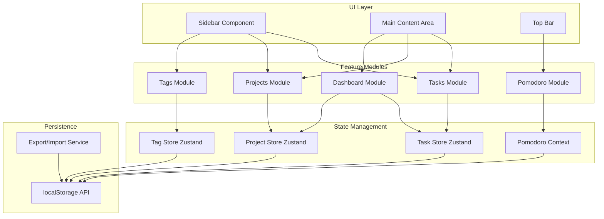
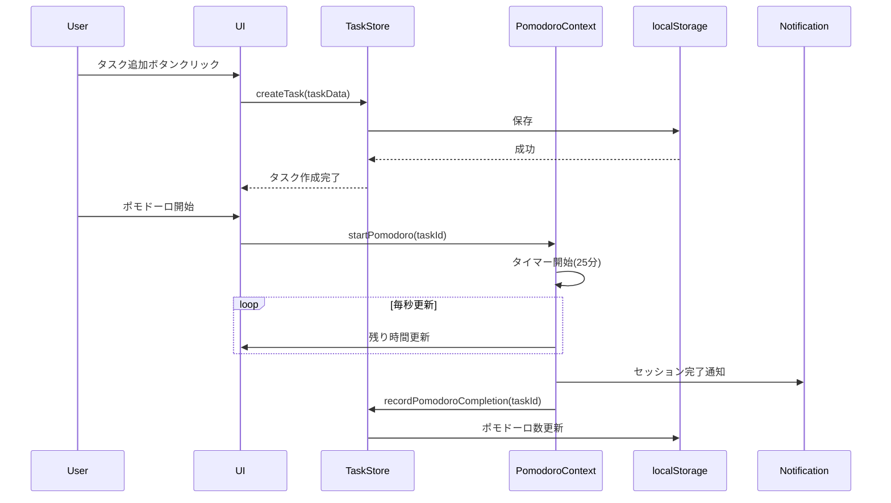
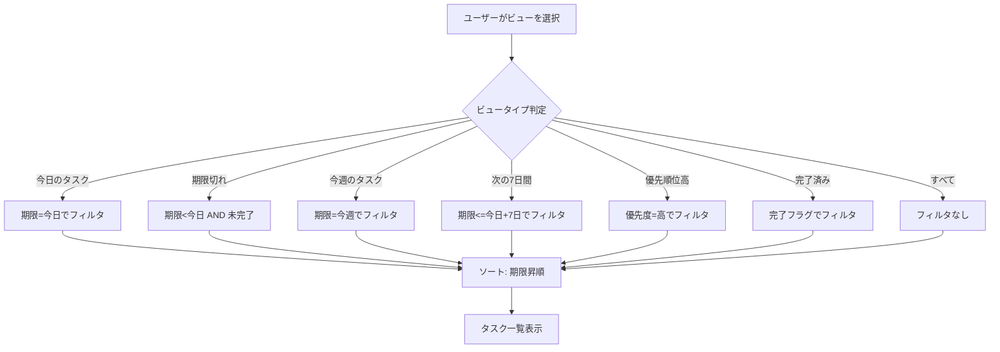
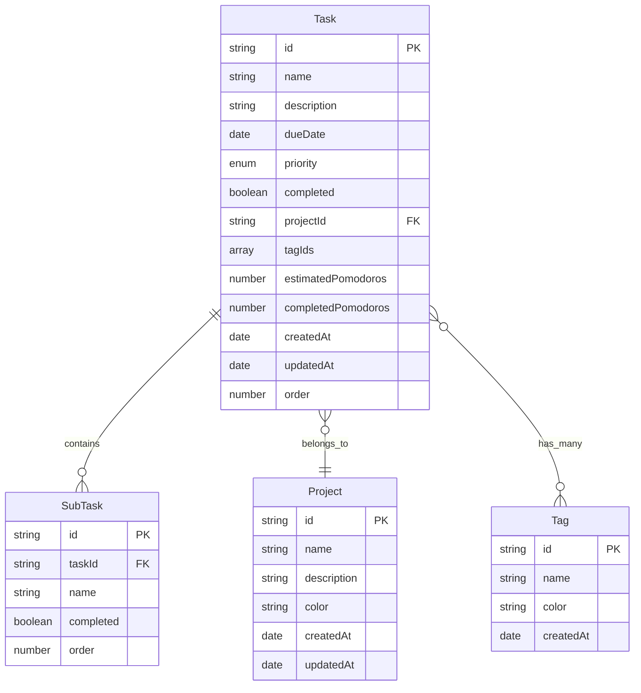

# Technical Design Document

## Overview
本機能は、ポモドーロ技法を統合したタスク管理アプリケーションを提供します。ユーザーは、タスクの作成・編集・削除、サブタスクによる分解、プロジェクト管理、タグ付け、複数のビュー、統計ダッシュボード、ポモドーロタイマーの統合を通じて、日々の作業を効率的に管理し、生産性を向上させることができます。

**Purpose**: このアプリケーションは、タスク管理とポモドーロ技法を組み合わせることで、ユーザーの集中力と生産性を最大化します。

**Users**: 個人ユーザー、フリーランサー、小規模チームが、日常的なタスク管理と時間管理のワークフローに利用します。

**Impact**: 新規Webアプリケーションとして実装され、既存システムへの影響はありません。

### Goals
- ユーザーが直感的にタスクを作成・管理・完了できる
- ポモドーロ技法を活用して集中的な作業セッションを実現する
- 複数のビューと統計情報でタスクの進捗を可視化する
- ローカルストレージを用いたオフライン動作を保証する

### Non-Goals
- クラウド同期機能(将来的な拡張として残す)
- チームコラボレーション機能
- カレンダー連携
- 複数デバイス間のリアルタイム同期

## Architecture

### Existing Architecture Analysis
新規プロジェクトのため、既存アーキテクチャとの統合は不要です。

### Architecture Pattern & Boundary Map

**Architecture Integration**:
- **Selected pattern**: Feature-based Monolithic Architecture
  - 各機能領域(Tasks, Projects, Tags, Pomodoro, Dashboard)を独立したモジュールとして配置
  - React 2025のベストプラクティスに準拠し、機能ごとにコンポーネント、フック、型定義を配置
- **Domain/feature boundaries**:
  - **Tasks Domain**: タスクのCRUD、サブタスク管理、ビューフィルタリング
  - **Projects Domain**: プロジェクトのCRUD、タスクとの関連付け
  - **Tags Domain**: タグのCRUD、タスクとの多対多関連
  - **Pomodoro Domain**: タイマー管理、セッション記録、通知
  - **Dashboard Domain**: 統計情報の集計と表示
  - **UI Domain**: 共通UIコンポーネント、レイアウト、テーマ管理
- **New components rationale**:
  - 各ドメインは独立したZustand storeを持ち、相互依存を最小化
  - ポモドーロドメインはContext APIで独立管理(UI固有の状態)
- **Steering compliance**: ステアリングドキュメントが存在しないため、React 2025のベストプラクティスに準拠



### Technology Stack

| Layer | Choice / Version | Role in Feature | Notes |
|-------|------------------|-----------------|-------|
| Frontend / CLI | React 18 + TypeScript 5 + Vite 5 | UIレンダリング、型安全性、ビルドツール | React 2025標準スタック、高速開発環境 |
| UI Components | Material-UI (MUI) v6 | プロダクションレディなUIコンポーネント | DatePicker、ダークモード、アクセシビリティ対応 |
| State Management | Zustand v4 + React Context API | グローバル状態管理 | シンプルで学習コストが低い |
| Drag & Drop | @dnd-kit/core v6 + @dnd-kit/sortable | タスクの並び替え機能 | アクティブメンテナンス、TypeScript完全対応 |
| Data / Storage | localStorage (Web Storage API) | データ永続化 | オフライン動作、シンプルな実装 |
| Infrastructure / Runtime | Browser (Chrome/Firefox/Safari/Edge) | 実行環境 | モダンブラウザ対応(ES2020+) |

詳細な技術選定の根拠とトレードオフは`research.md`を参照。

## System Flows

### タスク作成からポモドーロ実行までのフロー



### ビューフィルタリングとタスク表示フロー



## Requirements Traceability

| Requirement | Summary | Components | Interfaces | Flows |
|-------------|---------|------------|------------|-------|
| 1 | タスクの基本管理 | TaskStore, TaskForm, TaskList | TaskService, TaskState | タスク作成フロー |
| 2 | サブタスク管理 | SubTaskList, SubTaskForm | TaskService | タスク作成フロー |
| 3 | プロジェクト管理 | ProjectStore, ProjectForm, ProjectList | ProjectService | - |
| 4 | タグ機能 | TagStore, TagList, TagFilter | TagService | - |
| 5 | タスクビュー機能 | ViewSelector, TaskList | TaskService | ビューフィルタリングフロー |
| 6 | 概要ダッシュボード | DashboardStats, DashboardCharts | DashboardService | - |
| 7 | ポモドーロタイマー統合 | PomodoroTimer, PomodoroContext | PomodoroService | ポモドーロ実行フロー |
| 8 | タスク期限管理 | TaskList, DatePicker | TaskService | ビューフィルタリングフロー |
| 9 | データの永続化 | StorageService, ExportImport | StorageService | 全フロー |
| 10 | ユーザーインターフェース | Layout, Sidebar, TopBar, ThemeProvider | - | - |

## Components and Interfaces

### Component Summary

| Component | Domain/Layer | Intent | Req Coverage | Key Dependencies (P0/P1) | Contracts |
|-----------|--------------|--------|--------------|--------------------------|-----------|
| TaskStore | State | タスクデータのグローバル状態管理 | 1, 2, 5, 8 | StorageService (P0) | State |
| ProjectStore | State | プロジェクトデータのグローバル状態管理 | 3 | StorageService (P0) | State |
| TagStore | State | タグデータのグローバル状態管理 | 4 | StorageService (P0) | State |
| PomodoroContext | State | ポモドーロタイマーの状態管理 | 7 | TaskStore (P0), Notification API (P1) | State |
| StorageService | Service | localStorage永続化 | 9 | localStorage API (P0) | Service |
| TaskForm | UI | タスク作成・編集フォーム | 1 | TaskStore (P0), MUI (P0) | - |
| TaskList | UI | タスク一覧表示 | 1, 5, 8 | TaskStore (P0), dnd-kit (P1) | - |
| ProjectForm | UI | プロジェクト作成・編集フォーム | 3 | ProjectStore (P0), MUI (P0) | - |
| TagFilter | UI | タグフィルタリングUI | 4 | TagStore (P0) | - |
| PomodoroTimer | UI | タイマー表示とコントロール | 7 | PomodoroContext (P0), MUI (P0) | - |
| DashboardStats | UI | 統計情報表示 | 6 | TaskStore (P0), ProjectStore (P1) | - |
| Sidebar | UI | サイドバーナビゲーション | 4, 5, 10 | - | - |
| TopBar | UI | トップバーとクイックアクション | 1, 10 | TaskStore (P0) | - |
| Layout | UI | アプリケーションレイアウト | 10 | MUI (P0) | - |

### State Management

#### TaskStore

| Field | Detail |
|-------|--------|
| Intent | タスクのCRUD操作とビューフィルタリングを管理 |
| Requirements | 1, 2, 5, 8 |

**Responsibilities & Constraints**
- タスクの作成、更新、削除、完了状態管理
- サブタスクの管理と進捗計算
- ビューフィルタリング(今日、期限切れ、今週など)のロジック
- 変更時の自動localStorage保存

**Dependencies**
- Outbound: StorageService — データ永続化 (P0)
- Outbound: ProjectStore — プロジェクト参照 (P1)
- Outbound: TagStore — タグ参照 (P1)

**Contracts**: State [x]

##### State Management
```typescript
interface Task {
  id: string;
  name: string;
  description: string;
  dueDate: Date | null;
  priority: 'low' | 'medium' | 'high';
  completed: boolean;
  projectId: string | null;
  tagIds: string[];
  subTasks: SubTask[];
  estimatedPomodoros: number;
  completedPomodoros: number;
  estimatedDurationMinutes?: number; // 予定時間（分単位、デフォルト: 25分）
  createdAt: Date;
  updatedAt: Date;
  order: number;
}

interface SubTask {
  id: string;
  name: string;
  completed: boolean;
  order: number;
}

interface TaskStoreState {
  tasks: Task[];
  selectedView: ViewType;
  searchQuery: string;

  // Actions
  createTask: (task: Omit<Task, 'id' | 'createdAt' | 'updatedAt'>) => void;
  updateTask: (id: string, updates: Partial<Task>) => void;
  deleteTask: (id: string) => void;
  toggleTaskCompletion: (id: string) => void;
  reorderTasks: (taskIds: string[]) => void;

  addSubTask: (taskId: string, subTask: Omit<SubTask, 'id'>) => void;
  updateSubTask: (taskId: string, subTaskId: string, updates: Partial<SubTask>) => void;
  deleteSubTask: (taskId: string, subTaskId: string) => void;
  toggleSubTaskCompletion: (taskId: string, subTaskId: string) => void;

  setSelectedView: (view: ViewType) => void;
  setSearchQuery: (query: string) => void;

  getFilteredTasks: () => Task[];
  getTaskById: (id: string) => Task | undefined;
  getTasksByProject: (projectId: string) => Task[];
  getTasksByTag: (tagId: string) => Task[];
}

type ViewType =
  | 'today'
  | 'overdue'
  | 'tomorrow'
  | 'thisWeek'
  | 'next7Days'
  | 'highPriority'
  | 'upcoming'
  | 'completed'
  | 'all';
```

**State model**:
- Zustandストアとして実装
- Immerを使用してイミュータブルな更新を保証
- セレクタ関数でフィルタリングロジックを分離

**Persistence & consistency**:
- 状態変更時に自動的にlocalStorageへ保存
- デバウンス(300ms)で連続更新時のパフォーマンス最適化
- アプリ起動時にlocalStorageから復元

**Concurrency strategy**:
- シングルスレッド実行(JavaScript標準)
- 楽観的UI更新で即座にフィードバック

**Implementation Notes**
- Integration: StorageServiceを介してlocalStorageと同期
- Validation: タスク作成時にname必須、dueDateの妥当性検証、estimatedDurationMinutesのデフォルト値は25分
- Search Logic: searchQueryが空でない場合、name/description/tags/projectNameを対象に部分一致検索（大文字小文字区別なし）を実行。getFilteredTasks()内で検索フィルタを適用
- Risks: localStorage容量制限(監視とユーザー警告を実装)

#### ProjectStore

| Field | Detail |
|-------|--------|
| Intent | プロジェクトのCRUD操作と統計情報管理 |
| Requirements | 3 |

**Responsibilities & Constraints**
- プロジェクトの作成、更新、削除
- プロジェクト別タスク統計の計算
- プロジェクトカラーの管理

**Dependencies**
- Outbound: StorageService — データ永続化 (P0)

**Contracts**: State [x]

##### State Management
```typescript
interface Project {
  id: string;
  name: string;
  description: string;
  color: string; // Hex color code
  createdAt: Date;
  updatedAt: Date;
}

interface ProjectStoreState {
  projects: Project[];

  createProject: (project: Omit<Project, 'id' | 'createdAt' | 'updatedAt'>) => void;
  updateProject: (id: string, updates: Partial<Project>) => void;
  deleteProject: (id: string) => void;
  getProjectById: (id: string) => Project | undefined;
  getProjectStats: (id: string) => { totalTasks: number; completedTasks: number };
}
```

**Implementation Notes**
- Integration: TaskStoreと協調してタスク統計を計算
- Validation: プロジェクト名必須、color形式検証(Hex)
- Deletion Flow: プロジェクト削除時、関連タスクが存在する場合は確認ダイアログを表示し、ユーザーの承認後に削除を実行。削除時は関連タスクのprojectIdをnullに設定
- Risks: プロジェクト削除の影響範囲をユーザーに明示する必要あり（関連タスク数の表示）

#### TagStore

| Field | Detail |
|-------|--------|
| Intent | タグのCRUD操作と多対多関連管理 |
| Requirements | 4 |

**Responsibilities & Constraints**
- タグの作成、更新、削除
- タグごとのタスク数カウント
- タグの自動作成(新しいタグ名入力時)

**Dependencies**
- Outbound: StorageService — データ永続化 (P0)

**Contracts**: State [x]

##### State Management
```typescript
interface Tag {
  id: string;
  name: string;
  color: string; // Hex color code
  createdAt: Date;
}

interface TagStoreState {
  tags: Tag[];

  createTag: (tag: Omit<Tag, 'id' | 'createdAt'>) => void;
  updateTag: (id: string, updates: Partial<Tag>) => void;
  deleteTag: (id: string) => void;
  getOrCreateTag: (name: string) => Tag;
  getTagById: (id: string) => Tag | undefined;
  getTagTaskCount: (id: string) => number;
}
```

**Implementation Notes**
- Integration: TaskStoreと協調してタスク数を計算
- Validation: タグ名必須、重複名禁止
- Risks: タグ削除時の関連タスク処理(タスクのtagIds配列から削除)

#### PomodoroContext

| Field | Detail |
|-------|--------|
| Intent | ポモドーロタイマーの状態とセッション管理 |
| Requirements | 7 |

**Responsibilities & Constraints**
- タイマーの開始、一時停止、リセット、スキップ
- セッションフロー管理(Focus → Short break → Long break)
- 完了時の通知とポモドーロ数記録
- タイマー中のタスク強調表示

**Dependencies**
- Inbound: PomodoroTimer — UI操作 (P0)
- Outbound: TaskStore — ポモドーロ数記録 (P0)
- External: Notification API — セッション完了通知 (P1)
- External: Web Workers API — バックグラウンドタイマー (P2)

**Contracts**: State [x]

##### State Management
```typescript
interface PomodoroState {
  currentTaskId: string | null;
  phase: 'focus' | 'shortBreak' | 'longBreak';
  isRunning: boolean;
  remainingSeconds: number;
  completedPomodoros: number; // セッション内でのカウント

  settings: {
    focusDuration: number; // 秒単位 (デフォルト: 1500 = 25分)
    shortBreakDuration: number; // デフォルト: 300 = 5分
    longBreakDuration: number; // デフォルト: 900 = 15分
    longBreakInterval: number; // デフォルト: 4
  };
}

interface PomodoroContextValue extends PomodoroState {
  startPomodoro: (taskId: string) => void;
  pausePomodoro: () => void;
  resumePomodoro: () => void;
  resetPomodoro: () => void;
  skipPhase: () => void;
  updateSettings: (settings: Partial<PomodoroState['settings']>) => void;
}
```

**State model**:
- React Context APIとuseReducerで実装
- useRefでタイマーinterval IDを保持
- useEffectでタイマーのカウントダウン処理

**Persistence & consistency**:
- 設定のみlocalStorageに保存
- タイマー状態は一時的(リロード時にリセット)

**Concurrency strategy**:
- Document Visibility APIでタブ非アクティブ時の精度補正
- 将来的にWeb Workersで精度向上(P2依存)

**Implementation Notes**
- Integration: セッション完了時にTaskStore.updateTaskでポモドーロ数を記録
- Validation: タスクIDの存在確認、設定値の正の整数検証
- Risks: ブラウザタブ非アクティブ時のタイマー精度低下(Visibility APIで対応)

### Services

#### StorageService

| Field | Detail |
|-------|--------|
| Intent | localStorageへのデータ永続化とエクスポート/インポート |
| Requirements | 9 |

**Responsibilities & Constraints**
- JSON形式でのデータ保存と読み込み
- エラーハンドリング(容量超過、読み込み失敗)
- エクスポート/インポート機能(JSONファイル)

**Dependencies**
- External: localStorage API — データ永続化 (P0)

**Contracts**: Service [x]

##### Service Interface
```typescript
interface StorageService {
  save<T>(key: string, data: T): Result<void, StorageError>;
  load<T>(key: string): Result<T, StorageError>;
  remove(key: string): Result<void, StorageError>;
  clear(): Result<void, StorageError>;

  exportData(): Result<ExportData, StorageError>;
  importData(data: ExportData): Result<void, StorageError>;

  getUsedSpace(): number; // バイト単位
  getAvailableSpace(): number; // バイト単位
}

interface ExportData {
  version: string; // データフォーマットバージョン
  exportedAt: Date;
  tasks: Task[];
  projects: Project[];
  tags: Tag[];
  settings: Record<string, unknown>;
}

type StorageError =
  | { type: 'quota_exceeded'; message: string }
  | { type: 'parse_error'; message: string }
  | { type: 'not_found'; message: string }
  | { type: 'unknown'; message: string };

type Result<T, E> = { ok: true; value: T } | { ok: false; error: E };
```

**Preconditions**:
- localStorageが利用可能であること
- keyが空文字列でないこと

**Postconditions**:
- saveの成功時、localStorageにデータが保存される
- loadの成功時、パース済みデータが返される
- エラー時、適切なStorageErrorが返される

**Invariants**:
- 保存されたデータは常にJSON形式
- exportDataのversionは現在のアプリバージョンと一致

**Implementation Notes**
- Integration: 各ストアの変更時にデバウンス付きで呼び出される
- Validation: JSONスキーマ検証でインポートデータの妥当性を確認
- Risks: localStorage容量超過時のユーザー通知とアーカイブ提案

### UI Components

UI層のコンポーネントは、Material-UIの標準コンポーネントを活用し、プロジェクト固有のビジネスロジックを統合します。以下は主要な実装ノートです。

#### TaskForm
- **Intent**: タスク作成・編集フォーム
- **Integration**: TaskStoreのcreateTask/updateTaskを呼び出し
- **Validation**: 名前必須、期限の妥当性検証

#### TaskList
- **Intent**: タスク一覧表示とドラッグ&ドロップ並び替え
- **Integration**: TaskStore.getFilteredTasksでフィルタリング済みタスクを取得、dnd-kitで並び替え
- **Implementation Notes**: 仮想スクロール(react-window)で大量タスクのパフォーマンス最適化

#### PomodoroTimer
- **Intent**: タイマー表示と制御UI
- **Integration**: PomodoroContextの状態とアクションを利用
- **Implementation Notes**: 円形プログレスバーで残り時間を視覚化

#### DashboardStats
- **Intent**: 統計情報の集計と表示
- **Integration**: TaskStore/ProjectStoreから統計を計算
- **Implementation Notes**: Chart.jsまたはRechartsで週間統計グラフを表示

#### Sidebar
- **Intent**: ビュー選択、タグ一覧、プロジェクト一覧
- **Integration**: TaskStore.setSelectedView、TagStore、ProjectStore
- **Implementation Notes**: Material-UI Drawerコンポーネント、バッジでタスク数表示

#### TopBar
- **Intent**: アプリタイトル、クイックタスク追加、検索、テーマ切り替え
- **Integration**: TaskStore.createTask、ThemeContext
- **Implementation Notes**: Material-UI AppBarコンポーネント

## Data Models

### Domain Model

**Aggregates**:
- **Task Aggregate**: Task + SubTask[]
- **Project Aggregate**: Project (単独)
- **Tag Aggregate**: Tag (単独)

**Transactional boundaries**:
- Task集約は単一トランザクション(サブタスクを含む)
- ProjectとTagは独立したトランザクション

**Business rules & invariants**:
- タスク名は必須
- サブタスク完了率で親タスクの進捗を計算
- タグ名は一意
- プロジェクト削除時、関連タスクのprojectIdをnullに設定



### Logical Data Model

**Structure Definition**:
- TaskとSubTaskは1対多の関係
- TaskとProjectは多対1の関係(タスクは1つのプロジェクトに属する、またはnull)
- TaskとTagは多対多の関係(タスクは複数のタグを持つ)

**Consistency & Integrity**:
- TaskのprojectIdはProjectのidを参照(外部キー制約に相当)
- TaskのtagIdsはTagのid配列(正規化)
- SubTaskはTaskに従属(カスケード削除)

**Temporal aspects**:
- createdAtとupdatedAtでタスクの履歴を追跡
- 完了済みタスクはcompletedフラグで識別(論理削除ではなく状態管理)

### Physical Data Model

**localStorage実装**:
- 各ストアのデータは個別のキーで保存
  - `tasks`: Task[]
  - `projects`: Project[]
  - `tags`: Tag[]
  - `pomodoro_settings`: PomodoroSettings
- JSON.stringifyでシリアライズ、JSON.parseでデシリアライズ
- 容量制限: 約5MB(ブラウザ依存)

**インデックス戦略**:
- メモリ内でのフィルタリングとソート(localStorageはクエリ不可)
- TaskStore.getFilteredTasksでビューごとのフィルタリングロジックを実装
- 大量タスク時のパフォーマンス対策: メモ化(useMemo)とデバウンス

### Data Contracts & Integration

**Export/Import Schema**:
```typescript
interface ExportData {
  version: string; // "1.0.0"
  exportedAt: Date;
  tasks: Task[];
  projects: Project[];
  tags: Tag[];
  settings: {
    pomodoro: PomodoroSettings;
    theme: 'light' | 'dark';
  };
}
```

**Validation rules**:
- バージョン互換性チェック(マイナーバージョンまで互換)
- 必須フィールドの存在確認
- 型検証(Zodまたはカスタムバリデータ)

**Serialization format**: JSON
- Date型は ISO 8601 文字列として保存
- デシリアライズ時に Date オブジェクトに変換

## Error Handling

### Error Strategy

**User Errors (4xx)**:
- タスク名未入力 → フィールドレベルバリデーションエラー表示
- 無効な期限日付 → DatePickerでの入力制限とエラーメッセージ

**System Errors (5xx)**:
- localStorage容量超過 → ユーザーに警告ダイアログ、エクスポートとアーカイブを提案
- localStorage読み込み失敗 → エラー画面とリトライボタン
- Notification API未対応 → サイレントフォールバック(通知なし)

**Business Logic Errors (422)**:
- プロジェクト削除時に関連タスクがある → 確認ダイアログで影響を通知
- タグ名重複 → 既存タグを使用するか、別名を提案

### Error Categories and Responses

```typescript
type AppError =
  | { type: 'validation'; field: string; message: string }
  | { type: 'storage_quota'; message: string; usedSpace: number }
  | { type: 'storage_read'; message: string }
  | { type: 'not_found'; resource: string; id: string }
  | { type: 'unknown'; message: string };

interface ErrorBoundaryState {
  hasError: boolean;
  error: AppError | null;
}
```

### Monitoring

- React Error Boundaryで予期しないエラーをキャッチ
- StorageServiceで容量監視とログ記録
- コンソールにエラーログを出力(開発モード)

## Testing Strategy

### Unit Tests
- TaskStore: createTask、updateTask、getFilteredTasks、ビューフィルタリングロジック
- ProjectStore: createProject、getProjectStats
- TagStore: getOrCreateTag、タグ名重複検証
- StorageService: save、load、exportData、importData、容量超過エラー
- PomodoroContext: タイマーカウントダウン、フェーズ遷移、セッション完了処理

### Integration Tests
- TaskStore + StorageService: タスク作成後のlocalStorage保存確認
- PomodoroContext + TaskStore: セッション完了後のポモドーロ数記録
- TaskList + dnd-kit: ドラッグ&ドロップ後の順序更新
- Sidebar + TaskStore: ビュー選択後のフィルタリング結果確認

### E2E/UI Tests
- タスク作成 → ポモドーロ開始 → セッション完了 → ポモドーロ数更新のフルフロー
- サイドバーからビュー切り替え → タスク一覧更新
- ダークモード/ライトモード切り替え → テーマ適用確認
- エクスポート → インポート → データ復元確認

### Performance/Load Tests
- 1000タスクでのフィルタリングとレンダリング性能
- ドラッグ&ドロップの応答性(100タスク)
- localStorage書き込み頻度とデバウンス効果
- ポモドーロタイマーの精度(タブ非アクティブ時)

## Optional Sections

### Security Considerations

- **XSS対策**: Reactのデフォルトエスケープに依存、ユーザー入力を直接HTMLに挿入しない
- **データプライバシー**: ローカルストレージのみ使用、外部送信なし
- **CSP (Content Security Policy)**: 適用を推奨(外部スクリプト読み込みを制限)

### Performance & Scalability

**Target metrics**:
- 初期ロード時間: 3秒以内
- タスク一覧レンダリング(100タスク): 500ms以内
- フィルタリング応答: 100ms以内

**Optimization techniques**:
- React.memoでコンポーネントの不要な再レンダリングを防止
- useMemoでフィルタリング結果をメモ化
- react-windowで仮想スクロール(1000タスク以上)
- Code splittingでモジュールを遅延ロード(React.lazy)

**Caching strategies**:
- Zustandの状態をメモリキャッシュとして活用
- localStorageからの読み込みはアプリ起動時のみ

### Migration Strategy

新規アプリケーションのため、マイグレーション不要。

将来的なデータフォーマット変更時の戦略:
1. ExportDataのversionフィールドで互換性判定
2. マイグレーション関数でデータ変換
3. バックアップ推奨のユーザー通知

## Supporting References

該当なし(すべての詳細情報は本ドキュメントおよび`research.md`に含まれる)
